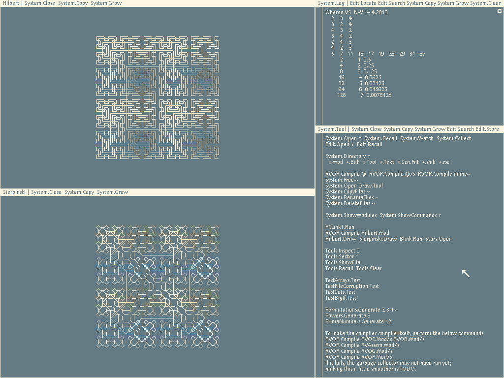

# Oberon RISC-V Emulator
Most of this readme is similar to the one in pdewacht's [RISC emulator](https://github.com/pdewacht/oberon-risc-emu/).

This is an emulator for Oberon running on RV32IM. For more information on Project Oberon,
[see Niklaus Wirth's site](https://www.inf.ethz.ch/personal/wirth/). For
newcomers to the Oberon family of operating systems, the document
[Using Oberon] in the [Project Oberon section] is a must-read.

[Using Oberon]: https://www.inf.ethz.ch/personal/wirth/ProjectOberon/UsingOberon.pdf
[Project Oberon section]: https://www.inf.ethz.ch/personal/wirth/ProjectOberon/index.html

## Building

To build the emulator, you need the SDL2 library and a C compiler that
understands C99 (GCC and clang are fine).

[SDL2]: http://libsdl.org/

### Linux

To install the needed packages on Debian, Ubuntu and derived
distributions, use this command:

    sudo apt-get install build-essential libsdl2-dev

See your distribution's documentation if you're using something else.

After that, build the emulator using the command `make`.

### OS X

I can't give much support for OS X, but I've had many reports saying
it works fine. The main stumbling block seems to be that there are two
ways to install the SDL development files: Unix style and Xcode style,
as explained in the [SDL Mac OS X FAQ].

For Unix style, build using the command `make`.
For Xcode style, use `make osx`.

[SDL Mac OS X FAQ]: https://wiki.libsdl.org/FAQMacOSX

### Windows

There's a pre-compiled version in Github's Releases section.

See the [SDL site][SDL2]  for how to set up a compiler
for Windows. It's fiddly.

Alternatively, you can set up a cross compiler from Linux, which is
also rather fiddle, and build with a command such as: (This is mostly
for my own future reference.)

    make CC=i686-w64-mingw32-gcc-win32 \
         SDL2_CONFIG=/usr/local/cross-tools/i686-w64-mingw32/bin/sdl2-config

## Disk image

You can find a RISC-V disk image in the [DiskImage/](DiskImage/) directory. It is mostly up-to-date, excepting:
- libraries for drawing circuits
- some programs such as checkers and EBNF, although they should be easy to add if you so wish!
- unsupported network interfaces: PCLink works, wireless network interfaces don't
To build your own RISC-V image, see [the RISC-V port here](https://github.com/solbjorg/oberon-riscv).

## Command line options

Usage: `risc [options] disk-image.dsk`

* `--fullscreen` Start the emulator in fullscreen mode.
* `--leds` Print the LED changes to stdout. Useful if you're working on the kernel,
  noisy otherwise.

Note: this emulator currently doesn't support variable resolution and memory allocation.

To run Oberon under RISC-V, simply run `./risc DiskImage/RVOberon.dsk`.

## Keyboard and mouse

The Oberon system assumes you use a US keyboard layout and a three button mouse.
You can use the left alt key to emulate a middle click.

The following keys are available:
* `Alt-F4` Quit the emulator.
* `F11` or `Shift-Command-F` Toggle fullscreen mode.
* `F12` Soft-reset the Oberon machine.

## Transferring files
First start the PCLink1 task by middle-clicking on the PCLink1.Run command. Transfer files using the pcreceive.sh and pcsend.sh scripts.
(Note that files sent from Oberon to your file system will not be readable by `cat`, as they use CR line endings.)

Clipboard integration is currently untested.

## Known issues

* The wireless network interface is not emulated.
* Proper documentation is needed.

## Copyright

Copyright © 2014 Peter De Wachter

Permission to use, copy, modify, and/or distribute this software for
any purpose with or without fee is hereby granted, provided that the
above copyright notice and this permission notice appear in all
copies.

THE SOFTWARE IS PROVIDED "AS IS" AND THE AUTHOR DISCLAIMS ALL
WARRANTIES WITH REGARD TO THIS SOFTWARE INCLUDING ALL IMPLIED
WARRANTIES OF MERCHANTABILITY AND FITNESS. IN NO EVENT SHALL THE
AUTHOR BE LIABLE FOR ANY SPECIAL, DIRECT, INDIRECT, OR CONSEQUENTIAL
DAMAGES OR ANY DAMAGES WHATSOEVER RESULTING FROM LOSS OF USE, DATA OR
PROFITS, WHETHER IN AN ACTION OF CONTRACT, NEGLIGENCE OR OTHER
TORTIOUS ACTION, ARISING OUT OF OR IN CONNECTION WITH THE USE OR
PERFORMANCE OF THIS SOFTWARE.
